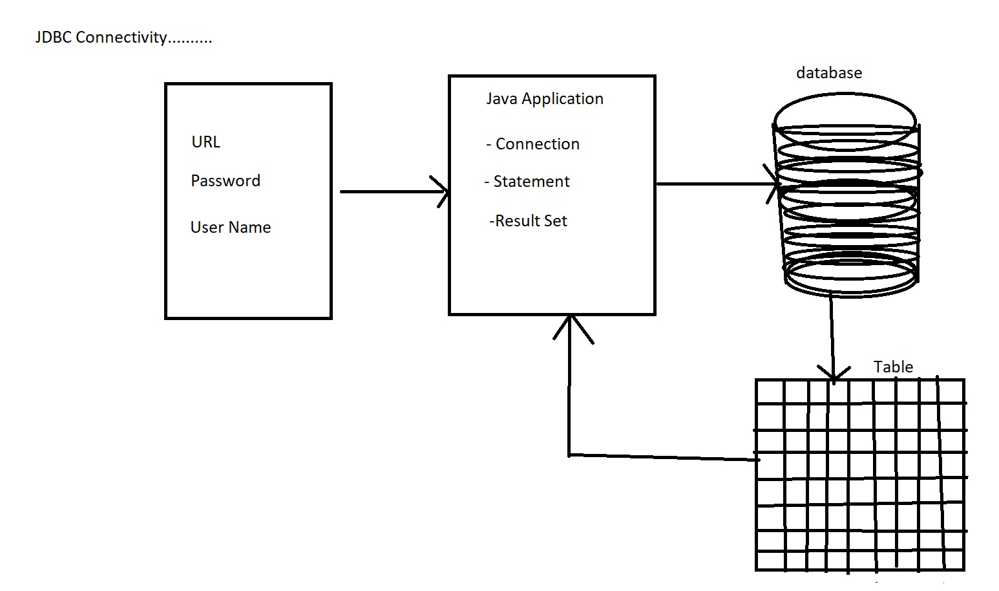

# Steps To Involve JDBC Connectivity.

```
1. Register Driver 
2. Get Connection
3. Create Statement
4. Execute Query
5. Close Connection/Result Set/ Statement 
```



## **Step-0 :** JDBC URL, USERNAME and PASSWORD Of MySQL server

```
private static final String url = "jdbc:mysql://localhost:3306/db_world ";  //Where db_world is database name. 

private static final String user = "root";

private static final String password = "root";

```
> `jdbc` : API Name

> `mysql` : database name

> `localhost` : server name

> `3306`: port number

> `database_name`: Database name 

## **Step-1:** Register Driver 

```
Class.forName("com.mysql.jdbc.Driver");
```

## **Step-2:** Get Connection

```
//JDBC Variables :: For opening and managing connection 

private static Connection con;

private static Statement stmt;

private static ResultSet rs;

//Opening Database Connection TO MySQL server 

con = DriverManager.getConnection(url, user, password);

```

## **Step-3:** Create Statement

```
//Getting statement object to execute query

stmt = con.createStatement();
```

## **Step-4:** Execute Query

```
//Run the query which is query1(It could be CRUD Operation) over here and result will be stored inside the Result Set object.

rs = stmt.executeQuery(query1);

// To Iterate Over the resultset object and fetch the data using the while loop.

while(rs.next())
{
    int id = rs.getInt(1);
    String name = rs.getString(2);
    String salary = rs.getString(3);
    System.Out.printf("empid : %d, empname : %s , salary : %s %n", id,name,salary);
}
```

## **Step-5: ** 5. Close Connection/Result Set/ Statement 

# Note To Remember:

> Every database has `different driver`.

> getConnection() > Using this method we connect to database. 